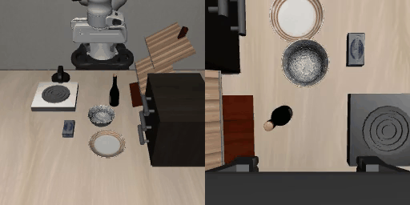
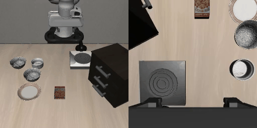

# RoboRT

机器人大模型推理引擎

## 环境搭建与编译

### 构建依赖
- cmake
- pkg-config
- python3
- protobuf-compiler
- libprotobuf-dev
- libzmq3-dev

### 编译（桌面端 GPU）

```bash
cmake -S . -B build -DCMAKE_BUILD_TYPE=Release \
  -DGGML_CUDA=ON -DCMAKE_CUDA_ARCHITECTURES=86
cmake --build build --target vla-pi05-server vla-pi05-selfcheck -j$(nproc)
```

### 模型转换

```bash
python src/models/pi05/convert_pi05_mmproj_to_gguf.py <hf_mmproj_dir> pi05-mmproj.gguf
python src/models/pi05/convert_pi05_to_gguf.py       <hf_ckpt_dir>    pi05.gguf
```

HY-VLA（腾讯 Hy-Embodied-0.5-VLA）转换到单文件 GGUF（双塔 VLM + 视觉塔 + flow
expert + 归一化统计全在一份文件里，无需 mmproj / tokenizer）：

```bash
python src/models/hy_vla/convert_hy_vla_to_gguf.py \
  --ckpt <hf_ckpt_dir> --out hy_vla.gguf \
  --norm-stats <norm_stats.pkl>   # 可选（归一化统计，见下）；缺失时用恒等归一化
```

- `--norm-stats`：归一化统计 `norm_stats.pkl`（由 Hy-Embodied-0.5-VLA 官方仓库的
  `scripts/compute_norm_robotwin.py` 产出；发行版 checkpoint 用 `--downsample-rate 3 --chunk-size 20`）。
- 产出约 1282 个张量、~9GiB（bf16），与参考 `Hy-Embodied-0.5-VLA-RoboTwin_bf16.gguf`
  结构一致（权重全 BF16、`norm.*` 统计 F32）。

## 运行

```bash
CUDA_VISIBLE_DEVICES=1 VLA_PI05_SEED=42 \
  ./build/bin/vla-pi05-server --bind tcp://*:5555 --timing-detail phase \
  <pi05-mmproj.gguf> <pi05.gguf>

CUDA_VISIBLE_DEVICES=1 VLA_PI05_SEED=42 \
  ./build/bin/vla-pi05-selfcheck <pi05-mmproj.gguf> <pi05.gguf> out.txt
```

HY-VLA（单 GGUF 参数；`vla-pi05-server` 按 GGUF 内 `hy_vla.architecture` 自动分派）：

```bash
CUDA_VISIBLE_DEVICES=1 VLA_HY_VLA_TEXT_LAYERS=32 VLA_HY_VLA_VISION_LAYERS=27 \
  ./build/bin/vla-pi05-server --bind tcp://*:5555 --timing-detail phase \
  <hy_vla.gguf>
```

> `VLA_HY_VLA_TEXT_LAYERS` / `VLA_HY_VLA_VISION_LAYERS` 控制加载的 VLM 文本层 /
> 视觉层数（发行版模型为 32 / 27）。不设则只跑 suffix expert，无法完整推理。

## 性能评估

### NVIDIA Jetson AGX Orin（首发部署目标）

#### pi0.5

- 评测平台：LIBERO（LeRobot 仿真，经网络连接 AGX Orin 推理）
- 模型：pi0.5（RoboRT 推理引擎，`--async` + `VLA_PI05_RTC=1`）
- 数据集：libero_10 / libero_goal / libero_object / libero_spatial（40 任务）
- 成功率：**39/40（97.5%）**
- 平均 infer：**104.3 ms/step**

| suite | 成功率 | 平均 infer |
|---|---:|---:|
| libero_10 | 9/10 | 101.1 ms/step |
| libero_goal | 10/10 | 105.9 ms/step |
| libero_object | 10/10 | 102.8 ms/step |
| libero_spatial | 10/10 | 107.4 ms/step |
| **总计** | **39/40（97.5%）** | **104.3 ms/step** |

| libero_goal | libero_object | libero_spatial |
|:------------------:|:------------------:|:------------------:|
|  |  |  |

#### HY-VLA

- 支持状态：已打通 Orin 部署路径（`VLA_HY_VLA_TEXT_LAYERS=32 VLA_HY_VLA_VISION_LAYERS=27`）
- LIBERO 评测结果：待补充

### NVIDIA A10（历史数据，桌面端）

#### pi0.5

- 评测平台：LIBERO（LeRobot 仿真）
- 模型：pi0.5（RoboRT 推理引擎）
- 数据集：libero_object
- 成功率：10/10（libero_object/task_0，seed 42）

| LeRobot 基线 | RoboRT | RoboRT Async + RTC |
|:------------------:|:------------------:|:------------------:|
|  |  |  |
| **377 ms/step** | **161 ms/step** | **18.7 ms/step** |

## 技术报告

RoboRT: A Real-Time C++ Inference Engine for pi0.5 Vision-Language-Action Policies（[PDF](docs/paper/robort-tech-report.pdf)，[LaTeX 源码](docs/paper/robort-tech-report.tex)）

## License

Apache-2.0（见 `LICENSE`）。`third_party/` 下第三方组件版权归各自作者，许可与版权声明见 `third_party/NOTICE`。
