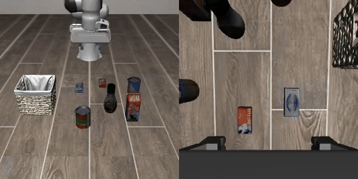
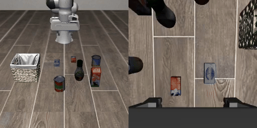

# RoboRT

机器人大模型推理引擎

## 项目结构

- `src/`：首方代码 —— API、模型实现、serving 服务、模型转换脚本
- `third_party/`：第三方组件 —— ggml 计算图运行时、mtmd 视觉编码、gguf-py、stb
- `docs/`：技术报告、论文与对比演示

## 环境搭建与编译


### 构建依赖
- cmake
- pkg-config
- python3
- protobuf-compiler
- libprotobuf-dev
- libzmq3-dev

### 编译

```bash
cmake -S . -B build -DCMAKE_BUILD_TYPE=Release \
  -DGGML_CUDA=ON -DCMAKE_CUDA_ARCHITECTURES=86
cmake --build build --target vla-pi05-server vla-pi05-selfcheck -j$(nproc)
```


### 模型转换

```bash
python src/models/pi05/convert_pi05_mmproj_to_gguf.py <hf_mmproj_dir> pi05-mmproj.gguf
python src/models/pi05/convert_pi05_to_gguf.py       <hf_ckpt_dir>    pi05.gguf
```

## 运行

```bash
CUDA_VISIBLE_DEVICES=1 VLA_PI05_SEED=42 \
  ./build/bin/vla-pi05-server --bind tcp://*:5555 --timing-detail phase \
  <pi05-mmproj.gguf> <pi05.gguf>

CUDA_VISIBLE_DEVICES=1 VLA_PI05_SEED=42 \
  ./build/bin/vla-pi05-selfcheck <pi05-mmproj.gguf> <pi05.gguf> out.txt
```

## LIBERO 评估

使用 wrapper 工程的 `run_libero_full.py` 客户端（`--tasks all --n-episodes 1 --seed-offset 42 --no-video --vla-addr tcp://localhost:5555`），注意 `VLA_CPP_PROTO` 需指向 `src/serving/vla.proto`。

## 效果对比

| LeRobot 基线 | RoboRT |
|:------------------:|:------------------:|
|  |  |
| **377 ms/step** | **161 ms/step** |

## 技术报告

RoboRT: A Real-Time C++ Inference Engine for pi0.5 Vision-Language-Action Policies（[PDF](docs/paper/robort-tech-report.pdf)，[LaTeX 源码](docs/paper/robort-tech-report.tex)）

## License

Apache-2.0（见 `LICENSE`）。`third_party/` 下第三方组件版权归各自作者，许可与版权声明见 `third_party/NOTICE`。
